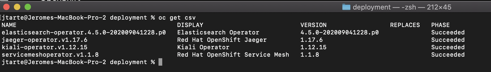
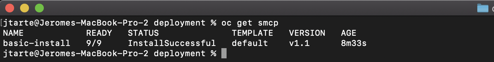
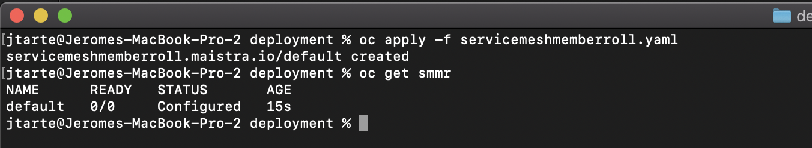

# Deploy service mesh by using CLI


## Deploy the operators 

Deploy the elasticsearch operator by applying [elasticsearch.yaml](../kubernetes/deployment/elasticsearch.yaml) script.


Wait to have a `Succeeded` state before to move to next operator.

Deploy the three remaining operators, in this order, by repeating the same process:
* Jaeger by using [jaeger.yaml](../kubernetes/deployment/jaeger.yaml)
* Kiali by using  [kiali.yaml](../kubernetes/deployment/kiali.yaml)
* Service mesh by using [servicemesh.yaml](../kubernetes/deployment/servicemesh.yaml)

 You could verify the result with the following command:
 ```
 oc get csv
 ```
 The four items should have a `Succeeded` phase.
 

## Create the service mesh control place. 

Create a project to host the service mesh control plane.
``` 
oc new-project istio-system
```

Create the service mesh by apply the script [servicemesh-controlplane.yaml](../kubernetes/deployment/jaeger.yaml)
```
oc apply -f servicemesh-controlplace.yaml
```

The different pods of the service mesh shoud start. You should wait thay are started and have 'running' state.
The result should be similar to the following picture


You could also verify the state of the service mesh control plane:
```
oc get scmp
````


## Create the service mesh member roll

To use the service mesh features, the projects that are managed by the service mesh control plane should be declared.  This could be done by creating a `servicemeshmemberroll`. 

But for the moment, there is no known application project. So, the `servicemeshmemberroll`will be created empty. It will be filled later when a project will be created.

Apply the [servicemeshmemberroll.yaml](../kubernetes/deployment/servicemeshmemberroll.yaml) script
```
oc apply -f servicemeshmemberroll.yaml
```



Now, the service mesh is up and running on your OpenShift instance. Your are ready to deploy application levearing service mesh features.
