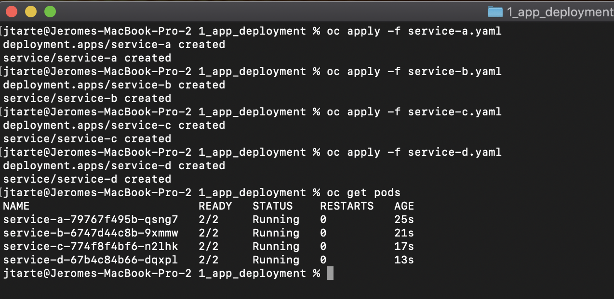
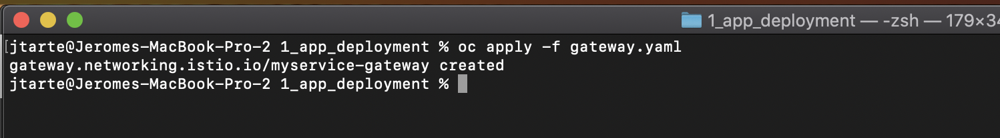
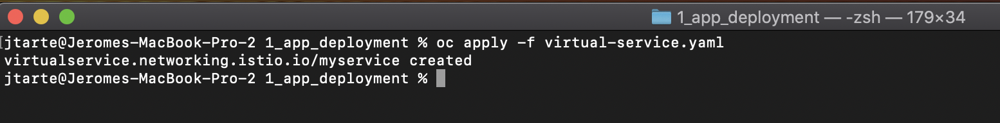
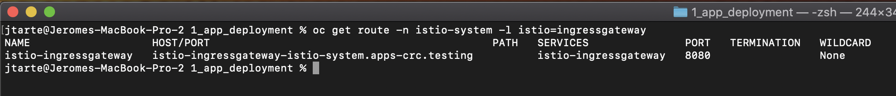
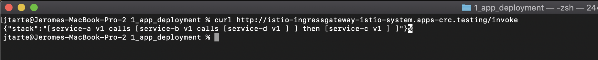
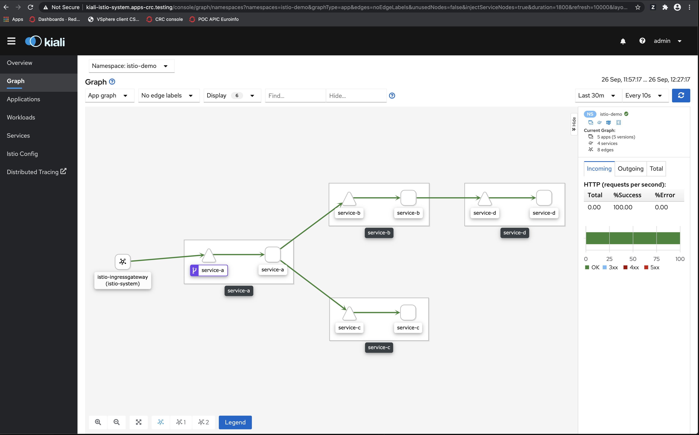

# Application deployment with service mesh enabled project

## Create the project
First, you should create the proejct and declare it as a project managed by the service mesh control plane.

Create the project
``` 
oc new-project istio-demo
````

Add the project as entry in the service mesh memeber roll
```
oc patch smmr default -n istio-system --type='json' -p '[{"op": "add", "path": "/spec/members", "value":["'"istio-demo"'"]}]'
``` 


If you check the project, it should have two labels `kiali.io/member-of=istio-system` and `maistra.io/member-of=istio-system`. It meams that the project is now managed by service mesh control plane. 


## Deploy the application 

The sample application is based on 4 services interacting together. 

All the files used in this page could be found [here](../kubernetes/1_app_deployment)

For each service, there is a yaml file:
```
apiVersion: apps/v1
kind: Deployment
metadata:
  name: service-a
  labels:
    purpose: istio-demo
spec:
  selector:
    matchLabels:
      app: service-a
  replicas: 1
  template:
    metadata:
      annotations:
        sidecar.istio.io/inject: "true"
      labels:
        app: service-a
        purpose: istio-demo
    spec:
      containers:
        - name: service-a
          image: image-registry.openshift-image-registry.svc:5000/default/myservice:latest
          imagePullPolicy: "Always"
          ports:
            - containerPort: 8080
          env:
            - name: NAME
              value: service-a
            - name: VERSION
              value: v1
            - name: TARGET
              value: service-b,service-c
--- 
apiVersion: v1
kind: Service
metadata:
  name: service-a
  labels:
    app: service-a
    purpose: istio-demo
spec:
  ports:
   - port: 80
     name: http
     targetPort: 8080
  selector:
   app: service-a

```

The four services use the image. The yaml file for each service is similar. It differs only on few parameters (name, version, ...)

The `TARGET` variable describes how the services interact together. It contains the name of the serices that will be called by the instance. here the service-a calls service-b and service-c. The names in this variable could be local name (same project) or external name. Multiple names are separated by a `,`. 

To deploy `service-a`, use the following command:
```
oc apply -f service-a.yaml
```

Redo the operation for `service-b`, `service-c`and `service-d`.



## Access to the application

At this stage, the services are deployed but they could not be accessed directly from outside ot the cluster. To resolve this point, we shoud define the way to access them.

First, a istio `gateway` should be defined. The [gateway.yaml](../kubernetes/1_app_deployment/gateway.yaml) described the ingress gateway used (by default `ingressgateway` from ìstio-system` project). It defined also the used protocol. Here HTTP. The value of `hosts` allows all hosts. 


```
apiVersion: networking.istio.io/v1alpha3
kind: Gateway
metadata:
  name: myservice-gateway
spec:
  selector:
    istio: ingressgateway # use istio default controller
  servers:
  - port:
      number: 80
      name: http
      protocol: HTTP
    hosts:
    - "*"
```

Deploy the gateway with the following command:
```
oc apply -f gateway.yaml
```



Then, a `virtualservice`should be created. It defines route rules that allow traffic for paths (here `/invoke`) to the targeted services, the `destination`.

``` 
apiVersion: networking.istio.io/v1alpha3
kind: VirtualService
metadata:
  name: myservice
spec:
  hosts:
  - "*"
  gateways:
  - myservice-gateway
  http:
  - match:
    - uri:
        exact: /invoke
    route:
    - destination:
        host: service-a
        port:
          number: 80 
```

Deploy the gateway with the following command:
```
oc apply -f virtualservice.yaml
```

 

## Test the application 

By default, the automatic route creation is not activated when you create an service mesh control plane. In this sample, it is the case. So no specific route is create when a `gateway` is defined. 

To access the service, you should use the default route of the ingress gateway. You could identify it with the following command:
``` 
oc get route -n istio-system -l istio=ingressgateway
```



You could use the result route to invoke your service

```
curl http://istio-ingressgateway-istio-system.apps-crc.testing/invoke
```


The reponse of the curl request shows the different call betwen the services as it has been designed into the sample service. 

By using Kiali, you could see a graph showing how the different services are connected into the mesh.




## Clean the project

To remove the resources used by this demo, use the following commands:

```
oc delete gateway -l purpose=istio-demo
oc delete virtualservice -l purpose=istio-demo 
oc delete service -l purpose=istio-demo 
oc delete deployment -l purpose=istio-demo
```

Before to delete the project, you shoudl remove the project from the project list managed by service mesh control plane. 

```
oc -n istio-system patch --type='json' smmr default -p '[{"op": "remove", "path": "/spec/members", "value":["'"istio-demo"'"]}]'
```

Then, you could delete the project
```
oc project default
oc delete project istio-demo
```


