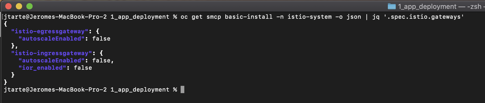
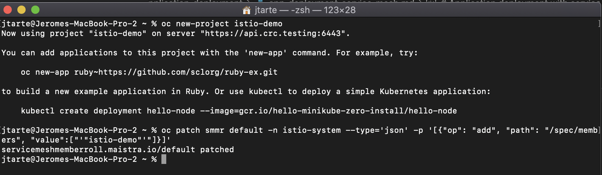
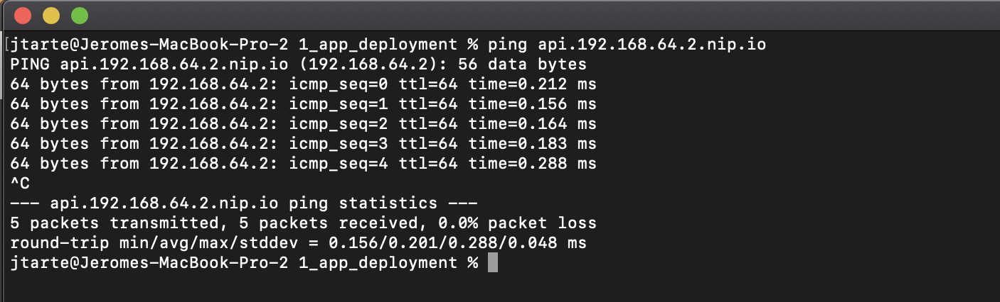
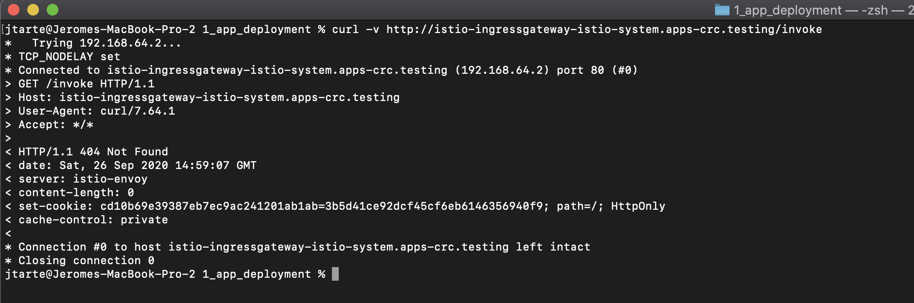

# Deploy application with automatic route creation

## Enable the automatic route creation
OpenShift routes for Istio Gateways are automatically managed in Red Hat OpenShift Service Mesh. Every time an Istio Gateway is created, updated or deleted inside the service mesh, an OpenShift route is created, updated or deleted. A Red Hat OpenShift Service Mesh control plane component called Istio OpenShift Routing (IOR) synchronizes the gateway route.

By default, IOR is not enabled when a service mesh control plane is created (`ior_enabled: false`). You could activate it when you create the service mesh control plane (change the value to `true`) or later. 

To check what is the value, you could use the following command

```
oc get smcp basic-install -n istio-system -o json | jq '.spec.istio.gateways'
```



If the value is false, you could change it with the folloing command:

```
oc -n istio-system patch --type='json' smcp basic-install -p '[{"op": "replace", "path": "/spec/istio/gateways/istio-ingressgateway/ior_enabled", "value":true}]'
```

## Create the project
First, you should create the proejct and declare it as a project managed by the service mesh control plane.

Create the project
``` 
oc new-project istio-demo
````

Add the project as entry in the service mesh memeber roll
```
oc patch smmr default -n istio-system --type='json' -p '[{"op": "add", "path": "/spec/members", "value":["'"istio-demo"'"]}]'
``` 


If you check the project, it should have two labels `kiali.io/member-of=istio-system` and `maistra.io/member-of=istio-system`. It meams that the project is now managed by service mesh control plane. 


## Deploy the application 

The sample application is based on 4 services interacting together. 

All the files used in this page could be found [here](../kubernetes/1_app_deployment)

For each service, there is a yaml file. Deploy 4 services:

To deploy `service-a`, use the [service-a.yaml](../kuebenetes/1_app_deployment/service-a.yaml) file with the following command:
```
oc apply -f service-a.yaml
```

Redo the command for `service-b` with [service-b.yaml](../kuebenetes/1_app_deployment/service-b.yaml) file.

Redo the command for `service-s` with [service-c.yaml](../kuebenetes/1_app_deployment/service-c.yaml) file.

Redo the command for `service-d` with [service-d.yaml](../kuebenetes/1_app_deployment/service-d.yaml) file.


## Host and network resolution

In this sample, I use the `nip.io` domain for my host. It simplify the work as I don't need to modify a DNS to declare my host.  `api.192.168.64.2.nip.io` hostname is automaticaly resolve as `192.168.64.2` IP address. 



You could use similar tips for your training or a FQDN that is resolved by a DNS. Of course, in production environment, it is recommended to use real DNS entry resolution.  

## Define Gateway and Virtual Service

At this stage, the services are deployed but they could not be accessed directly from outside ot the cluster. To resolve this point, we shoud define the way to access them.

First, a istio `gateway` should be defined. The [gateway_host.yaml](../kubernetes/1_app_deployment/gateway_host.yaml) described the ingress gateway used (by default `ingressgateway` from ìstio-system` project). It defined also the used protocol, here HTTP. The value of `hosts` define the host that is used to create the route, here `api.192.168.64.2.nip.io`. 

```
apiVersion: networking.istio.io/v1alpha3
kind: Gateway
metadata:
  name: myservice-gateway
  labels:
    purpose: istio-demo
spec:
  selector:
    istio: ingressgateway # use istio default controller
  servers:
  - port:
      number: 80
      name: http
      protocol: HTTP
    hosts:
    - "api.192.168.64.2.nip.io"
```

Deploy the gateway :
```
oc apply -f gateway_host.yaml
```

Once it is done, you should see a specific route for the defined host in the routes list of `istio-system`project. 


Then, a `virtualservice`should be created. It defines route rules that allow traffic for paths (here `/invoke`) to the targeted services, the `destination`. The host used is also defined. 


```
apiVersion: networking.istio.io/v1alpha3
kind: VirtualService
metadata:
  name: myservice
  labels:
    purpose: istio-demo
spec:
  hosts:
  - "api.192.168.64.2.nip.io"
  gateways:
  - myservice-gateway
  http:
  - match:
    - uri:
        exact: /invoke
    route:
    - destination:
        host: service-a
        port:
          number: 80
```

Deploy the gateway with the following command:
```
oc apply -f virtualservice.yaml
```

## Test the application

To access the service, you should use the created route of the ingress gateway. This route was automaticaly created by the service mesh and use the host provided in the gateway definition.

``` 
curl http://api.192.168.64.2.nip.io/invoke      
```


Using another route, like the default istio ingress route (`istio-ingressgateway-istio-system.apps-crc.testing`) as done in [demo 1](./app_deployment_service_mesh), generate an error (http answer 404).

. 

## Clean the project

To remove the resources used by this demo, use the following commands:

```
oc delete gateway -l purpose=istio-demo
oc delete virtualservice -l purpose=istio-demo 
oc delete service -l purpose=istio-demo 
oc delete deployment -l purpose=istio-demo
```

Before to delete the project, you shoudl remove the project from the project list managed by service mesh control plane. 

```
oc -n istio-system patch --type='json' smmr default -p '[{"op": "remove", "path": "/spec/members", "value":["'"istio-demo"'"]}]'
```

Then, you could delete the project
```
oc project default
oc delete project istio-demo
```