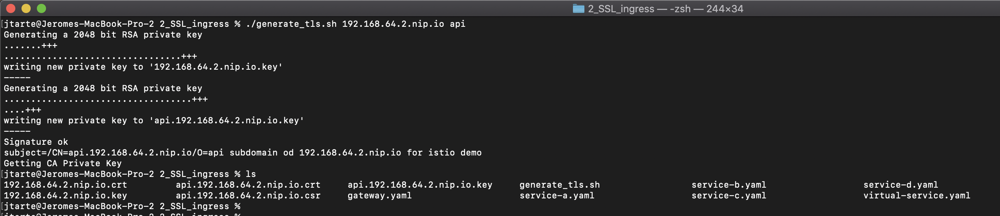
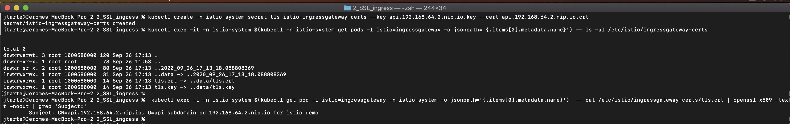
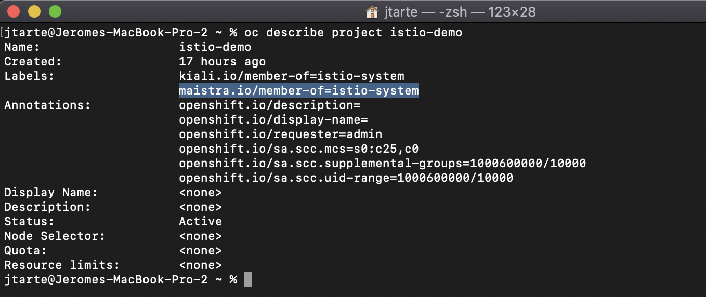
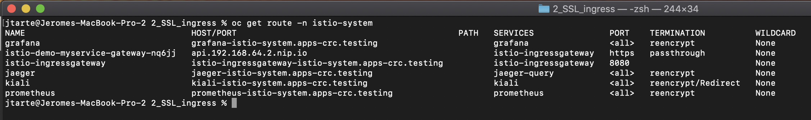
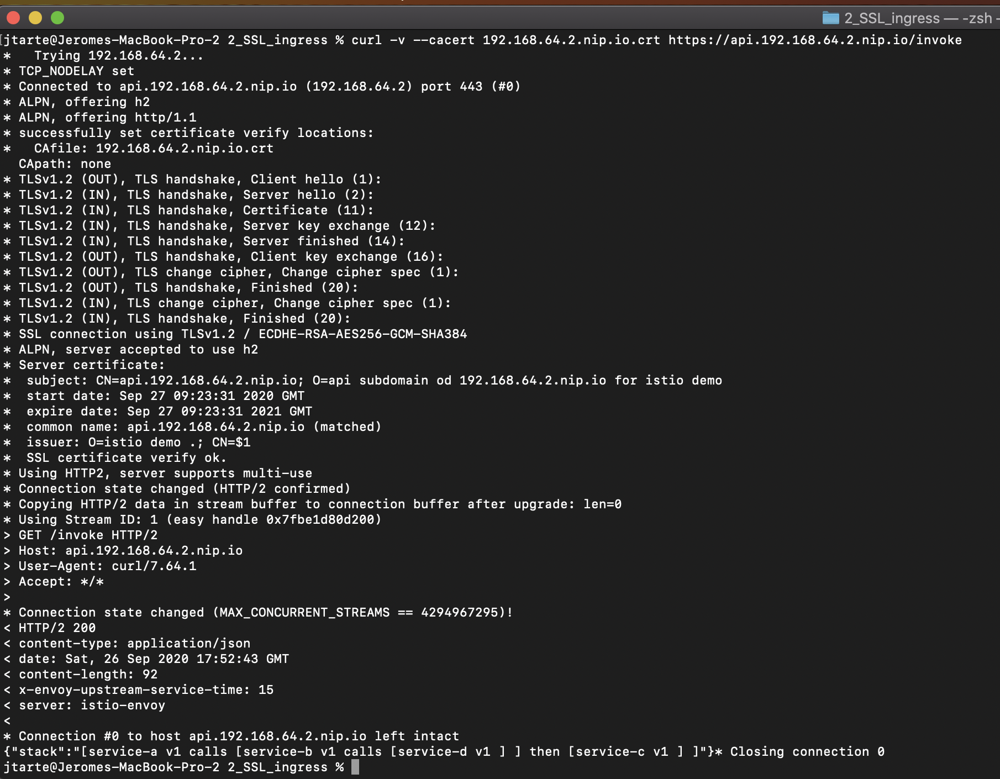

# Deploy application with secure ingress gateway


## Generate server certificate and private key

```
openssl req -x509 -sha256 -nodes -days 365 -newkey rsa:2048 -subj '/O=istio demo ./CN=$1' -keyout $1.key -out $1.crt
```

```
openssl req -out $2.$1.csr -newkey rsa:2048 -nodes -keyout $2.$1.key -subj "/CN=$2.$1/O=$2 subdomain od $1 for istio demo"

openssl x509 -req -days 365 -CA $1.crt -CAkey $1.key -set_serial 0 -in $2.$1.csr -out $2.$1.crt
```


```
./generate_tls.sh 192.168.64.2.nip.io api
```



```
kubectl create -n istio-system secret tls istio-ingressgateway-certs --key api.192.168.64.2.nip.io.key --cert api.192.168.64.2.nip.io.crt
``` 


``` 
kubectl exec -it -n istio-system $(kubectl -n istio-system get pods -l istio=ingressgateway -o jsonpath='{.items[0].metadata.name}') -- ls -al /etc/istio/ingressgateway-certs
``` 

You could verify that the `Subject` is correct in the certificate of the ingress gateway:
```
 kubectl exec -i -n istio-system $(kubectl get pod -l istio=ingressgateway -n istio-system -o jsonpath='{.items[0].metadata.name}')  -- cat /etc/istio/ingressgateway-certs/tls.crt | openssl x509 -text -noout | grep 'Subject:'
 ````



## Create the project
``` 
oc new-project istio-demo
````

Add the project as entry in the service mesh memeber roll
```
oc patch smmr default -n istio-system --type='json' -p '[{"op": "add", "path": "/spec/members", "value":["'"istio-demo"'"]}]'
``` 


If you check the project, it should have two labels `kiali.io/member-of=istio-system` and `maistra.io/member-of=istio-system`. It meams that the project is now managed by service mesh control plane. 



## Deploy the application 

The sample application is based on 4 services interacting together. 

All the files used in this page could be found [here](../kubernetes/2_SSL_ingress)

For each service, there is a yaml file. Deploy 4 services:

To deploy `service-a`, use the [service-a.yaml](../kuebenetes/2_SSL_ingress/service-a.yaml) file with the following command:
```
oc apply -f service-a.yaml
```

Redo the command for `service-b` with [service-b.yaml](../kuebenetes/2_SSL_ingress/service-b.yaml) file.

Redo the command for `service-s` with [service-c.yaml](../kuebenetes/2_SSL_ingress/service-c.yaml) file.

Redo the command for `service-d` with [service-d.yaml](../kuebenetes/2_SSL_ingress/service-d.yaml) file.


## Define Gateway and Virtual Service

At this stage, the services are deployed but they could not be accessed directly from outside ot the cluster. To resolve this point, we shoud define the way to access them.

First, a istio `gateway` should be defined. The [gateway_host.yaml](../kubernetes/2_SSL_ingress/gateway_host.yaml) described the ingress gateway used (by default `ingressgateway` from ìstio-system` project). It defined also the used protocol, here HTTP. The value of `hosts` define the host that is used to create the route, here `api.192.168.64.2.nip.io`. 

```
apiVersion: networking.istio.io/v1alpha3
kind: Gateway
metadata:
  name: myservice-gateway
spec:
  selector:
    istio: ingressgateway # use istio default controller
  servers:
  - port:
      number: 443
      name: https
      protocol: HTTPS
    tls:
      mode: SIMPLE
      serverCertificate: /etc/istio/ingressgateway-certs/tls.crt
      privateKey: /etc/istio/ingressgateway-certs/tls.key
    hosts:
    - "api.192.168.64.2.nip.io"
```

Deploy the gateway :
```
oc apply -f gateway_host.yaml
```

Once it is done, you should see a specific route for the defined host in the routes list of `istio-system`project. 


The route has `passthrough` termination has the ssl offload will be ensured by the istio ingress gateway service. 

Then, a `virtualservice`should be created. It defines route rules that allow traffic for paths (here `/invoke`) to the targeted services, the `destination`. The host used is also defined. 

```
apiVersion: networking.istio.io/v1alpha3
kind: VirtualService
metadata:
  name: myservice
spec:
  hosts:
  - "api.192.168.64.2.nip.io"
  gateways:
  - myservice-gateway
  http:
  - match:
    - uri:
        exact: /invoke
    route:
    - destination:
        host: service-a
        port:
          number: 80
```

Deploy the gateway with the following command:
```
oc apply -f virtualservice.yaml
```

## Test the application

To access the service, you should use the created route of the ingress gateway. This route was automaticaly created by the service mesh and use the host provided in the gateway definition.

``` 
curl http://api.192.168.64.2.nip.io/invoke      
```



## multiple host 


## Clean the project

To remove the resources used by this demo, use the following commands:

```
oc delete gateway -l purpose=istio-demo
oc delete virtualservice -l purpose=istio-demo 
oc delete service -l purpose=istio-demo 
oc delete deployment -l purpose=istio-demo
```
You shoudl also remove the secret used to store your certificates and key
```
oc delete secret istio-ingressgateway-certs -n istio-system
```
If you work with multiple hosts, you may have to remove the additional secrets. 


Before to delete the project, you shoudl remove the project from the project list managed by service mesh control plane. 

```
oc -n istio-system patch --type='json' smmr default -p '[{"op": "remove", "path": "/spec/members", "value":["'"istio-demo"'"]}]'
```

Then, you could delete the project
```
oc project default
oc delete project istio-demo
```